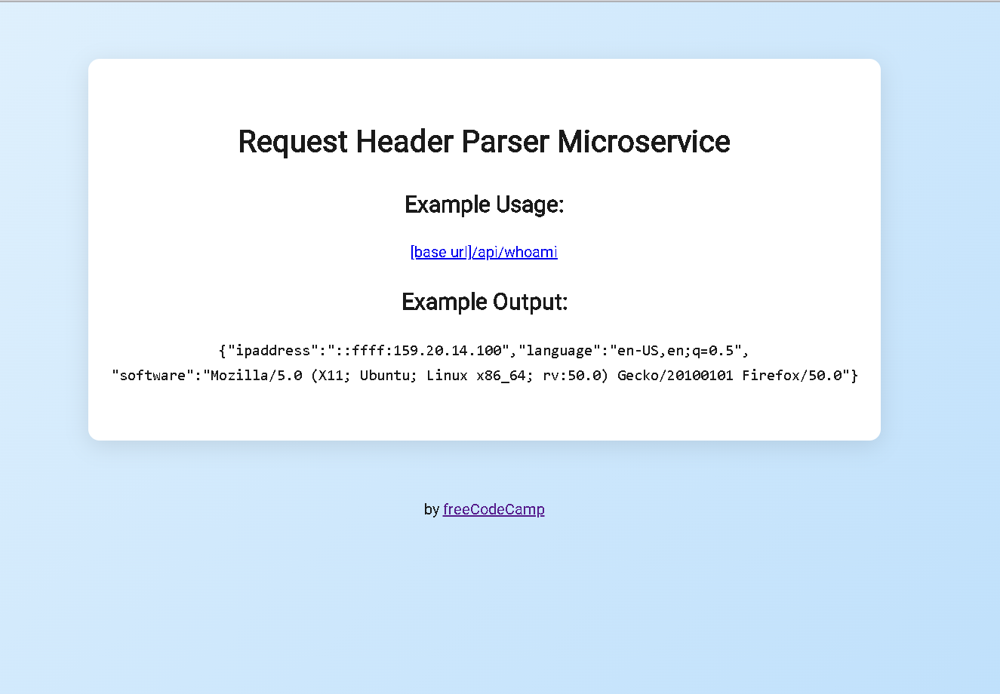

# Request Header Parser Microservice

Este es un proyecto de microservicio API para freeCodeCamp que analiza los encabezados de la solicitud HTTP y devuelve información sobre la IP, el idioma y el software del cliente.

## ¿Qué hace?

- Devuelve la dirección IP del cliente
- Devuelve el idioma preferido del cliente
- Devuelve información sobre el software/navegador del cliente

## Uso

1. Instala las dependencias:
   ```bash
   npm install
   ```
2. Inicia el servidor:
   ```bash
   npm start
   ```
3. Abre en tu navegador: [http://localhost:3000](http://localhost:3000)

### Endpoint principal

- `GET /api/whoami`
  - Responde con un JSON como este:
    ```json
    {
      "ipaddress": "::ffff:159.20.14.100",
      "language": "en-US,en;q=0.5",
      "software": "Mozilla/5.0 (X11; Ubuntu; Linux x86_64; rv:50.0) Gecko/20100101 Firefox/50.0"
    }
    ```

## Vista previa



> Coloca tu captura de pantalla en la carpeta `assets` con el nombre `screenshot.png`.

## Estructura del proyecto

```
project-root/
├── index.js
├── myApp.js
├── package.json
├── public/
│   └── style.css
├── views/
│   └── index.html
├── assets/
│   └── screenshot.png (agrega aquí tu imagen)
└── README.md
```

---

Hecho para el curso de APIs y Microservicios de freeCodeCamp.
